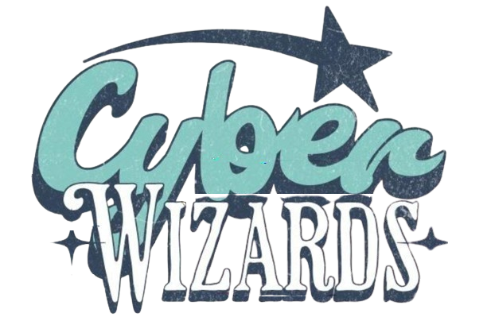

  

# Deskripsi Singkat

Kumpulan tugas Informatika di kelas **12-F1** sebagai arsip tugas-tugas **Web Development** dan dokumentasi kode lewat **GIT**.  
**Angkatan 2023–2026**, bersifat **FOS (Free and Open Source)** untuk digunakan oleh teman sekelas dan adik kelas yang memilih **Jurusan IT**.  
**Kelompok 4 PUNYA.**

---

  

---

## Timeline

## 14/10/2025 — *Tugas Koding Pertama: Latihan CSS*
**Kesulitan:** 

**File:**  
[⬇️ Klik untuk Download Langsung (ZIP)](https://github.com/SyafiqKarmen/WebForge_SMA1Ambon/raw/main/assets/zips/TugasLatihanCSS_14-10-2025.zip?download=1)

**Source Code:**  
[Lihat Source Code Latihan CSS](src/SourceCodeTugasLatihanCSS)

<blockquote>
Mempelajari implementasi CSS dalam HTML: Internal, External, dan Inline.
</blockquote>

---

## 23/10/2025 — *Pengenalan Django & Struktur Proyek*
**Kesulitan:** 

**File:**  
Tidak ada file tugas (materi pemahaman dasar Django).  

**Keterangan:**  
<blockquote>
Memahami cara kerja struktur proyek Django (folder `project_sisfodik`, `manage.py`, dan konfigurasi dasar).
</blockquote>

---

© 2025 Syafiq Adhyaraka Nazwir Karmen — CyberWizard Kelompok 4

